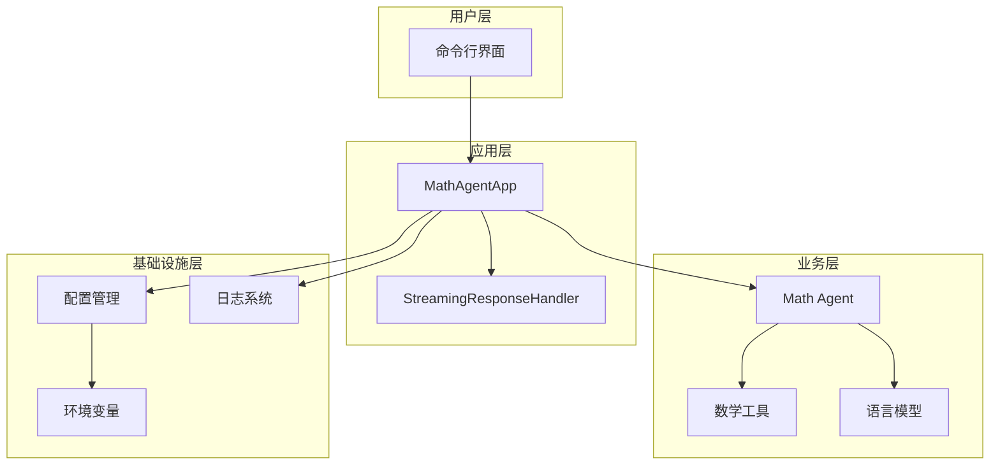
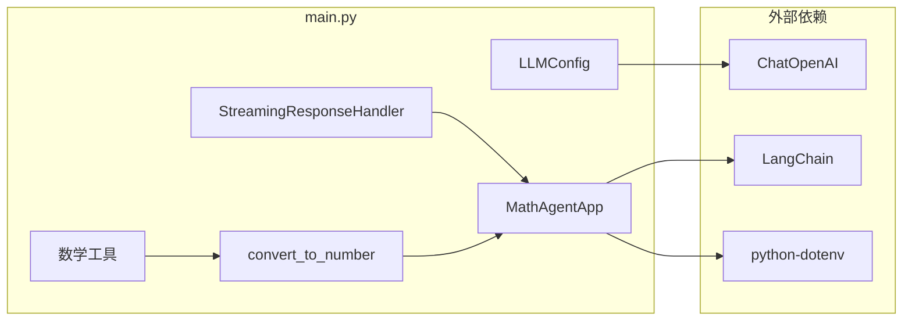
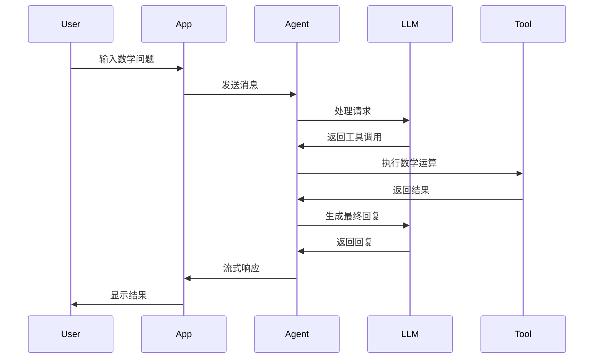
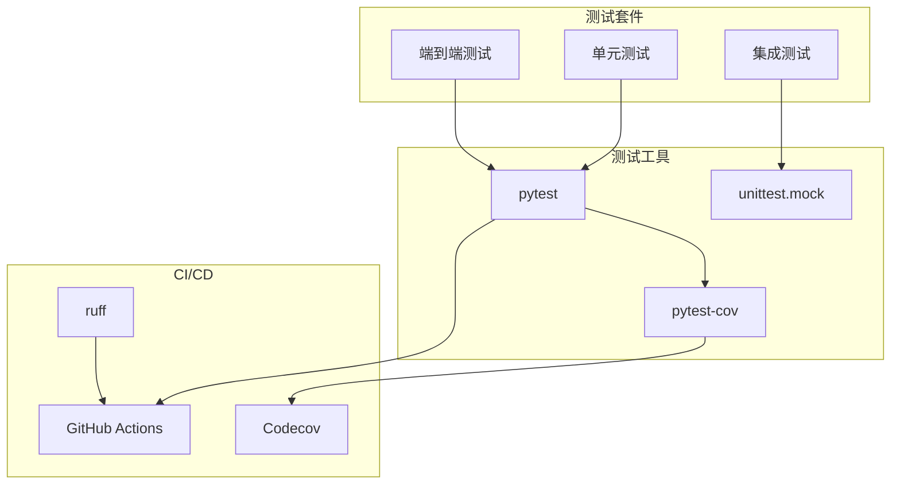

# 项目架构文档

## 🏗️ 整体架构



## 📦 模块依赖



## 🔄 数据流



## 🧪 测试架构



## 📁 项目结构

```
project1/
├── 📁 .github/workflows/          # CI/CD 配置
│   └── 📄 ci.yml
├── 📁 tests/                     # 测试套件
│   ├── 📄 __init__.py
│   ├── 📄 test_math_functions.py  # 数学函数测试
│   └── 📄 test_app.py             # 应用组件测试
├── 📄 main.py                    # 主应用文件
├── 📄 pyproject.toml             # 项目配置
├── 📄 pytest.ini                # 测试配置
├── 📄 Makefile                   # 开发命令
├── 📄 CLAUDE.md                  # 项目指导文档
├── 📄 ENTERPRISE_BEST_PRACTICES.md  # 最佳实践指南
├── 📄 ARCHITECTURE.md            # 架构文档
└── 📄 README.md                  # 项目介绍
```

## 🔧 核心组件

### 1. LLMConfig
- **职责**: 配置管理
- **特性**: 类型安全、默认值、验证

### 2. MathAgentApp
- **职责**: 应用主控制器
- **特性**: 依赖注入、错误处理、生命周期管理

### 3. StreamingResponseHandler
- **职责**: 流式响应处理
- **特性**: 实时输出、用户体验优化

### 4. 数学工具
- **职责**: 核心计算逻辑
- **特性**: 类型转换、错误处理、泛型支持

## 🎯 设计原则

### 1. 单一职责原则 (SRP)
每个类和函数都有明确的单一职责。

### 2. 开放封闭原则 (OCP)
对扩展开放，对修改封闭。

### 3. 依赖倒置原则 (DIP)
依赖抽象而不是具体实现。

### 4. 接口隔离原则 (ISP)
使用小而专一的接口。

## 📊 质量保证

### 代码质量
- ✅ 类型注解覆盖率: 100%
- ✅ 测试覆盖率: ≥ 80%
- ✅ 代码规范: ruff 检查通过

### 测试策略
- ✅ 单元测试: 68 个测试用例
- ✅ 参数化测试: 多种输入组合
- ✅ 模拟测试: 隔离外部依赖

### CI/CD
- ✅ 自动化测试
- ✅ 代码质量检查
- ✅ 覆盖率报告
- ✅ 安全扫描

## 🚀 扩展性

### 水平扩展
- 支持多种 LLM 提供商
- 支持插件式工具扩展
- 支持多种交互模式

### 垂直扩展
- 支持复杂度更高的数学运算
- 支持多步骤推理
- 支持上下文管理

这个架构设计确保了项目的可维护性、可扩展性和高质量。