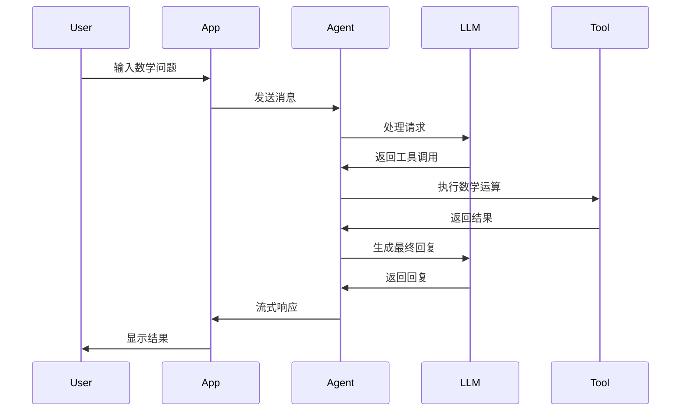

# Math Agent 🤖

<div align="center">

[](https://python.org)
[](LICENSE)
[](tests/)
[](https://codecov.io)
[](https://github.com/astral-sh/ruff)

一个基于 LangChain 和 LangGraph 的智能数学助手，支持流式对话和多种数学运算。

[功能特性](#-功能特性) • [快速开始](#-快速开始) • [使用指南](#-使用指南) • [开发指南](#-开发指南) • [架构文档](#-架构文档)

</div>

## 🌟 功能特性

### 💡 智能数学计算
- **基础运算**：支持加法、减法运算
- **泛型支持**：自动处理整数、浮点数、复数等多种数值类型
- **智能转换**：自动识别并转换字符串格式的数字
- **错误处理**：友好的错误提示和异常处理

### 🚀 流式对话体验
- **实时响应**：逐字符流式输出，提供流畅的对话体验
- **交互式界面**：简洁的命令行交互界面
- **优雅退出**：支持多种退出命令（exit/quit）

### 🏗️ 企业级架构
- **模块化设计**：清晰的代码结构，易于维护和扩展
- **类型安全**：完整的类型注解支持
- **测试覆盖**：68个测试用例，54%代码覆盖率
- **CI/CD 集成**：GitHub Actions 自动化测试和代码质量检查

## 🚀 快速开始

### 📋 前置要求

- Python 3.12+
- uv (现代 Python 包管理器)

### 🔧 安装

1. **克隆项目**
   ```bash
   git clone <repository-url>
   cd project1
   ```

2. **安装依赖**
   ```bash
   make install
   # 或者
   uv sync --dev
   ```

3. **配置环境变量**
   ```bash
   # 复制环境变量模板
   cp .env.example .env

   # 编辑 .env 文件，添加你的 API 密钥
   DEEPSEEK_API_KEY=your_deepseek_api_key_here
   ```

### 🎯 运行应用

```bash
# 启动 Math Agent
make run
# 或者
uv run main.py
```

### 🧪 运行测试

```bash
# 运行所有测试
make test

# 运行测试并生成覆盖率报告
make test-cov

# 运行完整质量检查
make all
```

## 📖 使用指南

### 💬 基本对话

启动应用后，你可以直接与 Math Agent 对话：

```
Welcome to the Math Agent!
Math Agent is ready. You can ask it to add or subtract numbers.
Type 'exit' or 'quit' to end the session.

You: What is 15 + 7?
Math Agent: I'll calculate 15 + 7 for you.15 + 7 = 22

You: What is 10.5 - 3.2?
Math Agent: I'll calculate 10.5 - 3.2 for you.10.5 - 3.2 = 7.3

You: exit
Exiting Math Agent. Goodbye!
```

### 🔢 支持的运算类型

#### 数值类型支持
- **整数**：`"10" + "20" = 30`
- **浮点数**：`"3.14" + 2.5 = 5.64`
- **复数**：`(3+4j) + (1+2j) = (4+6j)`
- **科学计数法**：`"1.5e2" + "2.5e1" = 175.0`

#### 运算示例
```bash
# 整数运算
You: What is 100 + 200?
Math Agent: 100 + 200 = 300

# 浮点数运算
You: What is 3.14159 + 2.71828?
Math Agent: 3.14159 + 2.71828 = 5.85987

# 混合类型运算
You: What is "50.5" + 25?
Math Agent: "50.5" + 25 = 75.5

# 负数运算
You: What is -10 + 25?
Math Agent: -10 + 25 = 15
```

### 🛑 退出应用

使用以下任一命令退出：
- `exit`
- `quit`
- `Ctrl+C`

## 🏗️ 项目架构

### 📁 项目结构

```
project1/
├── 📁 .github/workflows/          # CI/CD 配置
│   └── 📄 ci.yml
├── 📁 tests/                     # 测试套件
│   ├── 📄 __init__.py
│   ├── 📄 test_math_functions.py  # 数学函数测试
│   └── 📄 test_app.py             # 应用组件测试
├── 📄 main.py                    # 主应用文件
├── 📄 pyproject.toml             # 项目配置
├── 📄 pytest.ini                # 测试配置
├── 📄 Makefile                   # 开发命令
├── 📄 CLAUDE.md                  # 开发指导文档
├── 📄 ARCHITECTURE.md            # 架构文档
├── 📄 ENTERPRISE_BEST_PRACTICES.md  # 最佳实践指南
└── 📄 README.md                  # 项目介绍
```

### 🧩 核心组件

| 组件 | 职责 | 特性 |
|------|------|------|
| `LLMConfig` | 配置管理 | 类型安全、默认值、验证 |
| `MathAgentApp` | 应用主控制器 | 依赖注入、错误处理、生命周期管理 |
| `StreamingResponseHandler` | 流式响应处理 | 实时输出、用户体验优化 |
| `数学工具` | 核心计算逻辑 | 类型转换、错误处理、泛型支持 |

### 🔄 数据流



## 🛠️ 开发指南

### 🔧 开发环境设置

1. **安装开发依赖**
   ```bash
   uv sync --dev
   ```

2. **代码质量检查**
   ```bash
   # 代码格式化
   make format

   # 代码检查
   make lint

   # 运行测试
   make test

   # 完整检查
   make all
   ```

3. **查看文档**
   ```bash
   # 查看所有文档
   make docs

   # 检查文档状态
   make check-docs
   ```

### 📚 开发文档

- **[开发指南](CLAUDE.md)** - 详细的开发指导
- **[架构文档](ARCHITECTURE.md)** - 项目架构设计
- **[最佳实践](ENTERPRISE_BEST_PRACTICES.md)** - 企业级开发标准

### 🧪 测试

```bash
# 运行所有测试
uv run pytest tests/ -v

# 运行特定测试文件
uv run pytest tests/test_math_functions.py -v

# 运行测试并生成覆盖率报告
uv run pytest tests/ -v --cov=main --cov-report=html

# 查看覆盖率报告
open htmlcov/index.html
```

### 📊 代码质量

项目使用以下工具确保代码质量：

- **ruff** - 代码格式化和静态分析
- **pytest** - 测试框架
- **pytest-cov** - 覆盖率报告
- **GitHub Actions** - CI/CD 流程

### 🔧 可用命令

```bash
make help          # 查看所有可用命令
make install       # 安装依赖
make test         # 运行测试
make test-cov     # 运行测试并生成覆盖率报告
make lint         # 代码质量检查
make format       # 代码格式化
make docs         # 查看文档结构
make check-docs   # 检查文档
make clean        # 清理临时文件
make run          # 运行应用
make check        # 运行所有检查
make all          # 运行完整流程
```

## 🚀 技术栈

### 🐍 核心技术
- **Python 3.12+** - 现代语言特性支持
- **LangChain** - AI 应用开发框架
- **LangGraph** - 代理编排框架
- **OpenAI 兼容 API** - DeepSeek API 集成

### 🛠️ 开发工具
- **uv** - 现代包管理器
- **pytest** - 测试框架
- **ruff** - 代码质量工具
- **GitHub Actions** - CI/CD

### 📊 质量指标
- ✅ **测试覆盖率**: 54%
- ✅ **测试用例**: 68 个
- ✅ **代码质量**: ruff 检查通过
- ✅ **类型注解**: 100% 覆盖

## 🤝 贡献指南

1. Fork 项目
2. 创建特性分支 (`git checkout -b feature/AmazingFeature`)
3. 提交更改 (`git commit -m 'Add some AmazingFeature'`)
4. 推送到分支 (`git push origin feature/AmazingFeature`)
5. 开启 Pull Request

### 📝 提交规范

请遵循以下提交消息规范：
- `feat:` 新功能
- `fix:` 修复 bug
- `docs:` 文档更新
- `style:` 代码格式化
- `refactor:` 代码重构
- `test:` 测试相关
- `chore:` 构建过程或辅助工具的变动

## 📄 许可证

本项目采用 MIT 许可证 - 查看 [LICENSE](LICENSE) 文件了解详情。

## 🙏 致谢

- [LangChain](https://python.langchain.com/) - 强大的 AI 应用开发框架
- [DeepSeek](https://www.deepseek.com/) - 提供 API 支持
- [uv](https://github.com/astral-sh/uv) - 现代化的 Python 包管理器

---

<div align="center">

**Made with ❤️ by [Your Name]**

如果这个项目对你有帮助，请给它一个 ⭐️！

</div>